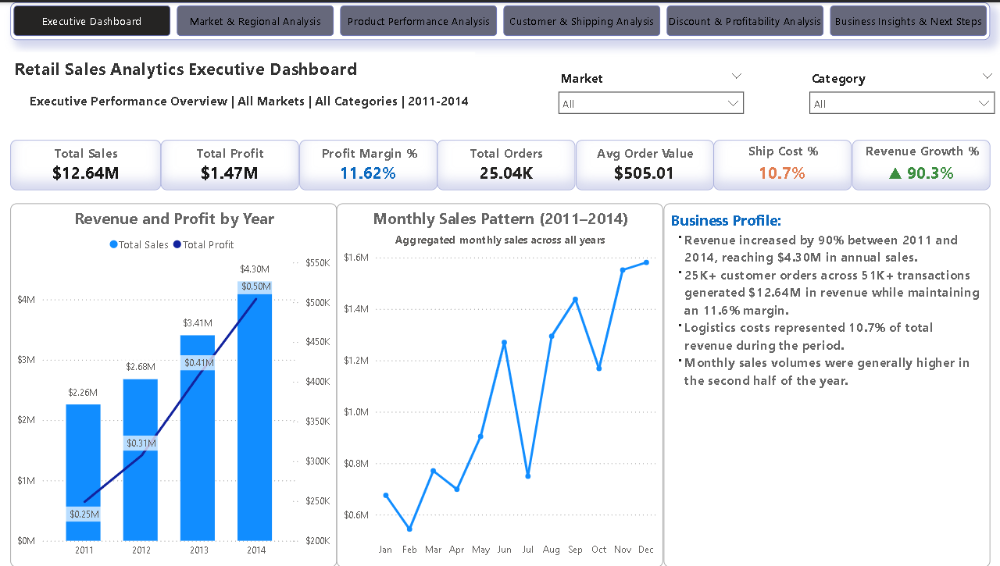
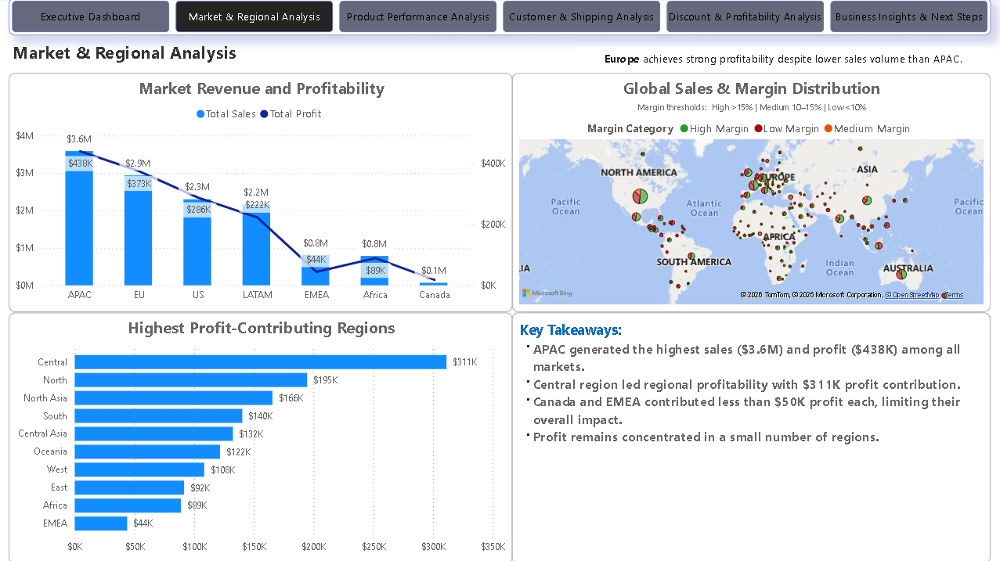
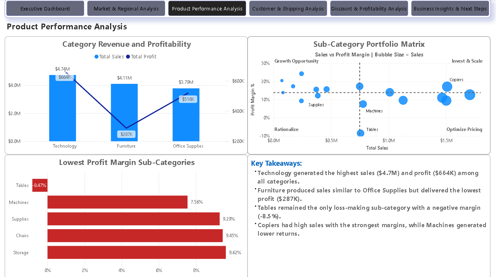
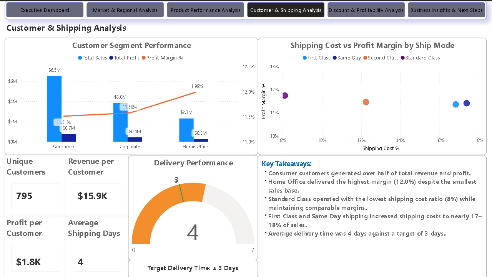
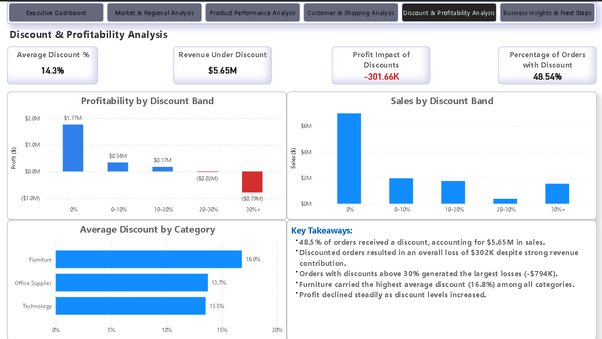

# Retail Sales Performance Analysis

## Repository Contents

| Component | Included |
|-----------|----------|
| Dataset | ✅ |
| SQL Analysis Scripts | ✅ |
| Power BI Dashboard (.pbix) | ✅ |
| Dashboard PDF Export | ✅ |
| Dashboard Screenshots | ✅ |
| Business Requirements Document | ✅ |

Sales grew from **$2.26M in 2011** to **$4.30M in 2014**.

Profit grew too, but not at the same pace.

The business generated **$12.64M in revenue** from more than **51,000 transactions**, but margins stayed close to **11.6%** throughout the period.

Europe generated less revenue than APAC, but stayed close on profit.

Discounts above **30%** were responsible for some of the largest losses in the business.

Shipping costs more than doubled between Standard Class and Same Day delivery, but margins barely moved.

The objective of the analysis was straightforward:

> **To understand why a business generating $12.64M in revenue retained only $1.47M in profit, and which parts of the business explained the gap.**

A few questions kept appearing throughout the analysis:

- Why did revenue nearly double while margins barely moved?
- Why was Europe keeping up with larger markets on profit?
- Why was Tables still losing money?
- Why were heavily discounted orders losing money at scale?
- Did faster shipping justify the extra cost?

---

## Project Snapshot

| Metric | Value |
|---------|-------|
| Revenue | $12.64M |
| Profit | $1.47M |
| Transactions | 51K+ |
| Orders | 25K+ |
| Customers | 795 |
| Profit Margin | 11.62% |

---
## Dashboard Preview

### Executive Dashboard


### Market & Regional Analysis


### Product Performance Analysis


### Customer & Shipping Analysis


### Discount & Profitability Analysis

## Tools Used

- **Excel** for data preparation and validation.
- **SQL** for exploratory analysis and KPI verification.
- **Power BI** for modelling, DAX calculations, and reporting.

---

## Repository Structure

```text
Dashboard/
├── Screenshots
├── Retail_Sales_Performance_Analysis.pbix
└── Retail_Sales_Performance_Analysis.pdf

Documentation/
└──  Retail_Sales_Analytics_BRD.pdf

SQL/
├── 01_Data_Validation_and_Cleaning.sql
├── 02_Exploratory_Analysis.sql
└── 03_KPI_and_Business_Analysis.sql


